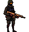
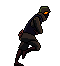
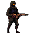
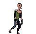
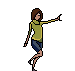
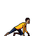
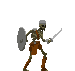
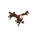
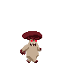
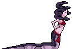

# ÂNIMA EDUCAÇÃO

**VINICIUS MARTINS BORGES**  
**RA:** 32328142  
**VITOR HUGO LIMA DE ALMEIDA**  
**RA:** 1242021781  
**GABRIEL PARRA BOITO**  
**RA:** 824152876  
**EDSON SOUZA BARRETO NETO**  
**RA:** 12724163069  
---

## Desenvolvimento de Jogo 2D - *Endless Siege*

---

### Sumário
1. [Introdução](#introdução)
    - [Objetivo](#objetivo)
2. [Enredo do Jogo](#enredo-do-jogo)
    - [História](#história)
    - [Objetivo do Personagem](#objetivo-do-personagem)
    - [Inimigos e Evolução](#inimigos-e-evolução)
3. [Desenvolvimento e Estrutura Técnica](#desenvolvimento-e-estrutura-técnica)
    - [Organização de Pastas](#organização-de-pastas)
4. [Desenvolvimento do Jogo](#desenvolvimento-do-jogo)
    - [Personagem Principal](#personagem-principal)
    - [Inimigos](#inimigos)
    - [Cenários](#cenários)
5. [Organização das Cenas e Hierarquia](#organização-das-cenas-e-hierarquia)

---

## 1. Introdução 

### 1.1 Objetivo 
Este projeto tem como objetivo desenvolver um jogo 2D, *Endless Siege*, focado na organização e estruturação das cenas e hierarquia de arquivos, configurando os elementos gráficos e a lógica de jogo.

## 2. Enredo do Jogo 

### 2.1 História 
Em um futuro sombrio, um experimento científico deu errado, desencadeando uma praga que transforma seres vivos em criaturas deformadas. O mundo está agora repleto de mortos-vivos, e as cidades estão desertas. Como soldado, sua missão é proteger uma tecnologia que pode reverter os efeitos da praga, enquanto luta pela sobrevivência.

### 2.2 Objetivo do Personagem 
O jogador assume o papel de um soldado enviado para resgatar uma tecnologia avançada. Enfrentando zumbis, esqueletos e outras criaturas, ele deve sobreviver o máximo possível, utilizando armas e habilidades especiais que encontra ao longo do caminho.

### 2.3 Inimigos e Evolução 
O soldado enfrenta inimigos variados que evoluem conforme o tempo passa:
- **Zumbis**: Movem-se lentamente em direção ao jogador.
- **Esqueletos**: Podem usar objetos como armas e escudos.
- **Olhos Voadores**: Criaturas rápidas que atacam em grupos.
- **Cogumelos**: Camuflam-se no ambiente para atacar o jogador.
- **Górgonas**: Comandam hordas de monstros menores, servindo como "rainhas" das criaturas.

## 3. Desenvolvimento e Estrutura Técnica 

Utilizamos a engine **Godot** para desenvolver o jogo. O projeto é nomeado *Endless Siege* e segue as melhores práticas de organização de pastas.

### 3.1 Organização de Pastas 
As pastas são organizadas da seguinte forma:
- **res://scenes/**: Cenas do jogo
- **res://assets/**: Elementos gráficos do jogo

## 4. Desenvolvimento do Jogo 

### 4.1 Personagem Principal 
 
 
 

O jogador controla um soldado experiente com a missão de proteger a tecnologia que pode reverter a praga. O soldado pode andar, pular e atirar para enfrentar inimigos.

### 4.2 Inimigos 
Durante o jogo, o soldado enfrentará vários inimigos, cada um com características únicas:
- **Zumbis**  
   
   
  
  Os zumbis se movem lentamente, avançando diretamente em direção ao soldado.

- **Esqueletos**  
  
  Esqueletos são mais ágeis e utilizam objetos para atacar.

- **Olhos Voadores**  
  
  Criaturas aladas que atacam em grupo, dificultando a movimentação do soldado.

- **Cogumelos**  
  
  Transformados pela praga, camuflam-se para pegar o jogador de surpresa.

- **Górgonas**  
  
  Comandam os outros monstros, servindo como líderes das hordas.

### 4.3 Cenários 
O cenário do jogo é apocalíptico, com cidades devastadas e áreas abandonadas. Os cenários são construídos com tiles e incluem:
- **Parallax Background**: Para adicionar profundidade e perspectiva.
- **Tilemap**: Utilizado para construir o chão, as plataformas e outras partes do cenário.

## 5. Organização das Cenas e Hierarquia 

A estrutura do jogo no **Godot** é organizada em várias cenas:
- **Main_Scene**: Cena principal que instancia as outras cenas.
- **Fundo_Scene**: Cena do cenário, configurada com o nó `TileMap` e o efeito de parallax.
  
### Hierarquia dos Nós
#### Fundo_Scene
- **Node2D**  
    - **TileMap**  
    - **ParallaxBackground**  
        - **ParallaxLayer**  
    - **Sprite2D**: Plano de fundo

#### Cena do Personagem
- **Node2D**  
    - **CharacterBody2D**  
        - **CollisionShape2D**: Área de colisão  
        - **AnimatedSprite2D**: Animações do personagem  
        - **Camera2D**: Focaliza o personagem durante o jogo

#### Cena dos Inimigos
Seguem a mesma estrutura da cena do personagem, exceto que não possuem o nó `Camera2D`.

#### Bullet_Scene (Cena do Tiro)
- **Node2D**  
    - **Area2D**: Física do tiro  
        - **CollisionShape2D**: Área de colisão  
        - **AnimatedSprite2D**: Animações da bala  
        - **VisibleOnScreenNotifier2D**: Destroi a bala quando sai da tela, evitando sobrecarga de instâncias.

---

Pronto! Com essa estrutura, o README está preparado para apresentar o jogo e servir como referência para quem quiser explorar o código e a organização do projeto no repositório.
